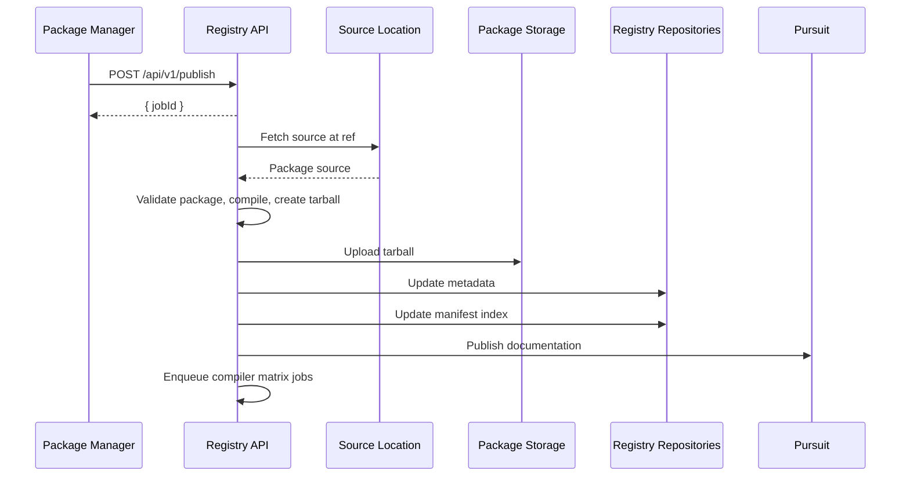

# Registry Spec

The PureScript Registry is a package registry for the PureScript programming language. It defines a standard manifest and a central index of packages, stores published package tarballs, and maintains curated package sets that list packages known to compile together. It also provides a PureScript library for ecosystem tooling to rely on when interacting with the registry. For example, package managers like Spago rely on the registry to publish packages, resolve dependencies, and download source code.

This specification defines the data formats used by the registry, the operations supports, and how package managers and other tooling should integrate with registry infrastructure. If you are interested in contributing to the registry, please refer to [CONTRIBUTING.md](./CONTRIBUTING.md).

## 1. Introduction

The PureScript Registry is an independent package registry for PureScript. It was created after the Bower registry (which PureScript previously relied on for package distribution) stopped accepting new submissions in 2020.

Packages from the Bower registry have been grandfathered into the registry so long as they satisfy registry requirements. The most restrictive requirement is that package versions compile with at least one compiler version from 0.13.0 onwards. This means packages published prior to May 2019 are not in the registry and can only be used with legacy package managers (Bower, legacy Spago).

The registry addresses several limitations of Bower and introduces new features of its own:

- **Independence**: The registry is controlled by the PureScript core team and all third-party infrastructure is commodity (file storage, etc.)
- **Immutability**: Published packages are stored permanently. Unlike Bower, which only pointed to upstream repositories, the registry stores package source code so dependencies cannot disappear or be altered after publication apart from a short period where unpublishing is supported.
- **Content hashes**: Every package tarball is hashed (SHA256 in SRI format), allowing for integrity verification, and this hash is stored in a format suitable for build systems which require hashes such as Nix.
- **Pull model**: Authors do not upload packages directly. Instead, they request that the registry fetch their code from a public location; this avoids user authentication and file uploads and lets the registry perform checks on the package before admitting it.
- **Declarative manifests**: Package manifests declare properties about packages without imperative hooks like npm's `postinstall`
- **Verified builds**: All packages are known to solve and compile with at least one supported compiler version. This enables features like Pursuit's compiler compatibility filter and allows solvers to produce build plans targeting a specific compiler.
- **Location-agnostic publishing**: Packages can be published from any supported location type, including arbitrary git repositories, not just GitHub.
- **Mono/polyrepo support**: A single repository can host multiple packages using the `subdir` field in the package location data
- **First-class package sets**: The registry curates sets of packages known to compile together, updated automatically on a daily schedule.

### 1.1 Important Terminology

The following terms are used throughout this specification with specific meanings.

**Core Data Types**

- **Package**: A versioned unit of PureScript source code with a manifest, stored as an archive in the registry.
- **Package name**: A unique identifier for a package (see [PackageName](#packagename)).
- **Version**: A specific release of a package, identified by a semantic version (see [Version](#version)).
- **Range**: A constraint specifying acceptable versions of a dependency (see [Range](#range)).
- **Location**: The remote location from which the registry fetches package source code (see [Location](#location)).
- **Ref**: An arbitrary reference identifying a particular snapshot of the code at a location. For Git locations this would be a Git ref such as a tag or commit hash.
- **Owner**: An SSH public key whose holder is authorized to perform sensitive operations on a package.
- **License**: An SPDX license identifier specifying the terms under which a package may be used and redistributed.
- **Sha256**: A base64-encoded SHA256 hash in subresource integrity (SRI) format, used to verify archive integrity.

**Registry Data Structures**

- **Manifest**: A `purs.json` file declaring package properties such as name, version, license, location, and dependencies (see [Manifest](#33-manifest)).
- **Metadata**: Information about a package maintained by the registry, including published versions, hashes, and ownership (see [Metadata](#34-metadata)).
- **Package set**: A curated collection of package versions known to compile together with a specific compiler version (see [Package Set](#35-package-set)).
- **Manifest index**: A cache of all package manifests stored in the registry-index repository (see [Manifest Index](#36-manifest-index)).
- **Operation**: A request sent to the registry to perform an action. Package operations (publish, unpublish, transfer) are sent to the registry HTTP API; package set operations are submitted via GitHub issues.

**Roles**

- **Package manager**: A tool such as Spago that publishes packages to the registry and installs them for users.
- **Registry Trustee**: A member of the [@purescript/packaging](https://github.com/orgs/purescript/teams/packaging) team with authority to perform administrative actions on behalf of the registry.

### 1.2 Related Infrastructure

The registry relies on several pieces of infrastructure:

- **[purescript/registry](https://github.com/purescript/registry)**: The user-facing repository containing package metadata files and package set releases.
- **[purescript/registry-index](https://github.com/purescript/registry-index)**: A cache of all package manifests, structured for efficient lookup by package managers.
- **[packages.registry.purescript.org](https://packages.registry.purescript.org)**: The storage backend where package tarballs are hosted.
- **[registry.purescript.org](https://registry.purescript.org)**: The registry HTTP API server.
- **@pacchettibotti**: A bot account controlled by the Registry Trustees, used for automated registry operations.

Related ecosystem tools include:

- **[Spago](https://github.com/purescript/spago)**: The standard PureScript package manager and build tool, which integrates with the registry.
- **[Pursuit](https://pursuit.purescript.org)**: The PureScript documentation hosting service; the registry publishes documentation to Pursuit after a successful publish.

## 2. Package Publishing

This section provides a high-level walkthrough of how a package is published to the registry. For detailed specifications of the data types involved, see [Section 3 (Schemas)](#3-schemas-data-type-representations-used-in-the-registry). For a complete description of verification steps and failure modes, see [Section 5.1 (Publish a Package)](#51-publish-a-package).

### 2.1 Publishing Flow Overview

Publishing a package begins with a package manager (such as Spago, or an open GitHub issue on the `registry` repository) sending a `Publish` request to the registry HTTP API. The registry then fetches the package source, validates it, creates a tarball, and updates its indexes.



### 2.2 Example: Publishing `effect@4.0.0`

#### Step 1: Submit a Publish Request

A package manager submits a POST request to `https://registry.purescript.org/api/v1/publish` with a JSON body:

```json
{
  "name": "effect",
  "location": {
    "githubOwner": "purescript",
    "githubRepo": "purescript-effect"
  },
  "ref": "v4.0.0",
  "version": "4.0.0",
  "compiler": "0.15.10"
}
```

The registry responds immediately with a job ID that can be polled for status:

```json
{
  "jobId": "01234567-89ab-cdef-0123-456789abcdef"
}
```

#### Step 2: Source Fetched and Validated

The registry fetches the package source from the specified location at the given ref. It expects to find a supported manifest format—currently `purs.json` or `spago.yaml`, though additional formats may be supported in the future. For example, a `purs.json` manifest:

```json
{
  "name": "effect",
  "version": "4.0.0",
  "license": "BSD-3-Clause",
  "location": {
    "githubOwner": "purescript",
    "githubRepo": "purescript-effect"
  },
  "ref": "v4.0.0",
  "description": "Native side effects",
  "dependencies": {
    "prelude": ">=6.0.0 <7.0.0"
  }
}
```

The registry validates that the manifest matches the publish request, resolves dependencies, and compiles the package to verify it builds successfully.

#### Step 3: Tarball Created and Uploaded

The registry creates a tarball of the package source. The tarball always contains a `purs.json` file for compatibility—if the package only had a `spago.yaml`, a `purs.json` is generated and included. The tarball is uploaded to the storage backend at:

```
https://packages.registry.purescript.org/effect/4.0.0.tar.gz
```

#### Step 4: Indexes Updated

The registry updates two repositories:

**Metadata** (in `purescript/registry` at `metadata/effect.json`):

```json
{
  "location": {
    "githubOwner": "purescript",
    "githubRepo": "purescript-effect"
  },
  "published": {
    "4.0.0": {
      "bytes": 3245,
      "hash": "sha256-abc123...",
      "publishedTime": "2024-01-15T10:30:00.0Z",
      "compilers": ["0.15.10"]
    }
  },
  "unpublished": {}
}
```

**Manifest Index** (in `purescript/registry-index`):

The manifest is appended as a JSON line to the appropriate index file (in this case `ef/fe/effect`), making it available for package managers to query.

#### Step 5: Documentation Published

The registry compiles documentation and uploads it to [Pursuit](https://pursuit.purescript.org). Documentation publishing requires a minimum compiler version (currently 0.14.7); packages published with older compilers will skip this step. A failure to publish documentation does not fail the overall publish operation.

### 2.3 Compiler Compatibility Testing

After a package is successfully published, the registry enqueues background jobs to test the package against other supported compiler versions. These "matrix jobs" run independently and update the `compilers` field in the package metadata as they complete. The registry also enqueues matrix jobs for packages that depend on the newly-published package, propagating compatibility testing through the dependency graph.

This means the list of compatible compilers in metadata may be incomplete immediately after publishing, but will become accurate as the background jobs finish—typically within minutes to hours depending on registry load.

### 2.4 Package Set Candidacy

After a successful publish, the package version becomes a candidate for automatic inclusion in the next package set release. Package sets are updated daily; see [Section 6.3 (Publish to Package Sets)](#63-publish-to-package-sets) for details on how packages are added to the curated package set.

## 3. Schemas: Data Type Representations Used in the Registry

Types alone can't capture the set of invariants applied to data processed by the registry, so this section provides the full set of rules for common data types.

### 3.1 Compatibility Guarantees

The registry guarantees forward compatibility for its core data types. Forward compatibility means that older clients will always be able to read data written by newer clients. This guarantee is critical because package manifests are baked into immutable package tarballs forever: any client, including older ones, must always be able to read any manifest in the registry.

The data types covered by this guarantee are:

- [`Manifest`](#33-manifest): the `purs.json` manifest format
- [`Metadata`](#34-metadata): the package metadata file format

To maintain forward compatibility, the only permitted schema changes are:

1. **Adding new optional fields**: New optional fields may be introduced; older clients will ignore them.
2. **Removing optional fields**: Optional fields may be removed if no longer needed.
3. **Relaxing constraints**: Constraints not enforced by the type system may be loosened (e.g., increasing a maximum length).

Changes that would break forward compatibility (such as removing required fields, renaming fields, or changing the type of a field) are not permitted **under any circumstances**.

### 3.2 Atomic Data

This section contains schemas for `PackageName`, `Version`, `Range`, `Location`, `Sha256`, `Owner`, `License`, and other simple data used in the registry. Each is a subsection which includes its rules, the representations in Dhall and JSON, and a link to the PureScript implementation in `Schema.purs`.

#### PackageName

**[Source](./lib/src/Registry/PackageName.purs)**
**[Spec](./types/v1/Manifest.dhall)**

Packages are uniquely identified by their `PackageName`. No two packages in the registry can share the same name. A package name represented as a `string`, with the following restrictions:

- Must be no more than 50 characters long
- Must contain only letters and digits, optionally separated by hyphens
- Must begin with a letter or digit
- Cannot contain consecutive hyphens
- Cannot begin with `purescript-`

The final point deserves elaboration. Historically, PureScript packages have been registered in the Bower registry using a `purescript-` prefix so as to avoid naming conflicts with JavaScript packages. However, the prefix is not actually part of the package name, so package managers like Spago refer to the package without the prefix. For example, the Bower-registered name `purescript-prelude` refers to the `prelude` package, which is located in the GitHub repository `purescript/purescript-prelude`. This prefix is not used in the PureScript registry. The `purescript-prelude` Bower package is simply `prelude` in the PureScript registry.

We still encourage users to name their repositories with a `purescript-` prefix to make it easier to find PureScript packages on platforms like GitHub. However, to prevent users from accidentally registering their packages with an unnecessary prefix, the registry will not accept packages that begin with `purescript-` unless the package author confirms this is what they want with the Registry Trustees.

#### Version

**[Source](./lib/src/Registry/Version.purs)**
**[Spec](./types/v1/Manifest.dhall)**

Packages are associated with one or more versions, representing their source code at a point in time. The registry uses a restricted version of the SemVer spec which only allows versions with major, minor, and patch places (that means no build metadata and no prerelease identifiers). A version is represented as a `string` with the following restrictions:

- The string must have the form `"X.Y.Z"`, representing major, minor, and patch places.
- The major, minor, and patch places must each be natural numbers (ie. whole numbers equal to or greater than 0).

We never use a `v` prefix on versions.

The major, minor, and patch places of a version describe the public interface of the library (ie. everything exported by its modules, such as types, instances, functions, or values). Each place has a specific meaning:

- `MAJOR`: Indicates a breaking change to the public interface, such as removing a function, changing its type, or changing its behavior in a significant way. Upgrading any dependency to a new major version also counts as a breaking change.
- `MINOR`: Indicates a non-breaking change to the public interface, such as adding a new function. Updating any dependency to a new minor version also counts as a minor change.
- `PATCH`: Indicates a documentation change or an internal change that does not change the public interface, such as fixing a bug in an implementation.

The `X.Y.Z` form maps on to these three kinds of change with the following rules:

1. If a package uses all three places (ie. it begins with a non-zero number, such as `"1.0.0"`), then the version implies `MAJOR.MINOR.PATCH`.
2. If a package only uses two places (ie. it begins with a zero, such as `"0.1.0"`), then the version implies `0.MAJOR.MINOR`.
3. If a package uses only one place (ie. it begins with two zeros, such as `"0.0.1"`), then all changes are potentially breaking changes, ie. `0.0.MAJOR`.

#### Range

**[Source](./lib/src/Registry/Range.purs)**
**[Spec](./types/v1/Manifest.dhall)**

It is sometimes necessary to refer to a range of versions, such as when specifying dependency versions or supported compiler versions. The registry uses a restricted form of SemVer ranges; a version range is represented as a `string` with the following restrictions:

- The string is always of the form `">=X.Y.Z <X.Y.Z"`.
- Both versions (`X.Y.Z`) must be valid [`Version`](#version)s.
- The first version must be less than the second version.

When comparing versions, the major place takes precedence, then the minor place, and then the patch place. For example:

- `1.0.0` is greater than `0.12.0`
- `0.1.0` is greater than `0.0.12`
- `0.0.1` is greater than `0.0.0`

For example: `">=1.0.1 <2.0.0"`

#### Location

**[Source](./lib/src/Registry/Location.purs)**
**[Spec](./types/v1/Location.dhall)**

The registry operates on a pull-based model, in which package authors ask the registry to fetch their code and produce a package instead of uploading their package themselves. Accordingly, every package is associated with the location the registry will use to fetch it. A location is represented in JSON as an `object`.

Packages can be located anywhere online so long as that location is publicy-accessible and the registry understands how to fetch code from it.

By convention, locations are represented in JSON using the following rules:

- Common fields (`url`, `owner`, `repo`) are prefixed with the provider name, ie. `githubOwner` or `gitlabRepo` or `gitUrl`.
- Providers that support a typical filesystem structure must support an optional `subdir` key so that the registry can provide monorepo support for that location type.

The currently-supported location types are listed below.

**Git Repository**

An arbitrary Git repository is represented by a JSON `object` with a required `gitUrl` key and optional `subdir` key. The Git URL must be of the form: `http[s]://host.xz/path/to/repo[.git]`. The registry uses the `git` CLI tool to fetch your repository. A JSON example:

```json
{
  "gitUrl": "https://git.sr.ht/~rj/purescript-image",
  "subdir": "lib"
}
```

**GitHub Repository**

The registry has special support for fetching Git repositories hosted on GitHub. Instead of cloning the repository it will fetch the tarball of the package contents. To specify a GitHub repository you must provide the name of the owner and of the repository, along with an optional subdirectory containing the package source. A JSON example:

```json
{
  "githubOwner": "purescript",
  "githubRepo": "purescript-prelude"
}
```

Or, using a monorepo:

```json
{
  "githubOwner": "purescript",
  "githubRepo": "purescript-core",
  "subdir": "prelude"
}
```

#### Owner

**[Source](./lib/src/Registry/Owner.purs)**
**[Spec](./types/v1/Owner.dhall)**

The registry relies on SSH key pairs to verify package ownership for the purposes of sensitive API operations like unpublishing versions or transferring packages. An `Owner` is made up of the three components of an SSH public key in text format ([RFC4253](https://www.rfc-editor.org/rfc/rfc4253#section-6.6)). That format looks like this:

`[keytype] [ssh-public-key] [comment (optional)]`

Note that the comment is optional and is referred to as the "id" in the registry. A JSON example:

```jsonc
{
  "keytype": "ssh-ed25519",
  "public": "ABCD3FGzaC1lZDI1NTE5AAAAINq4q0EHXacxMzmcG7TNC1DJpSxpK5dhJA6uAlZ",
  "id": "john@abc"
}
```

Alternately, this can be written without an id:

```jsonc
{
  "keytype": "ssh-ed25519",
  "public": "ABCD3FGzaC1lZDI1NTE5AAAAINq4q0EHXacxMzmcG7TNC1DJpSxpK5dhJA6uAlZ"
}
```

#### License

**[Source](./lib/src/Registry/License.purs)**
**[Spec](./types/v1/License.dhall)**

All packages in the registry must have a license that grants permission for redistribution of the source code. Concretely, the registry requires that all packages use an SPDX license and specify an [SPDX license identifier](https://spdx.dev/ids/). `AND` and `OR` conjunctions are allowed, and licenses can contain exceptions using the `WITH` preposition. The SPDX specification describes [how licenses can be combined and exceptions applied](https://spdx.dev/ids#how).

A `License` is represented as a string, which must be a valid SPDX identifier. For example:

`"MIT OR APACHE-2.0"`

#### Sha256

**[Source](./lib/src/Registry/Sha256.purs)**
**[Spec](./types/v1/Sha256.dhall)**

The registry produces an archive file when publishing a package. We use [tarballs](https://wiki.debian.org/TarBall) as our archive format. The registry produces a tarball when publishing a package. The hash of this tarball is recorded so that package managers can verify the integrity of packages they download from the registry. The hash is stored in the [subresource integrity (SRI) format](https://developer.mozilla.org/en-US/docs/Web/Security/Subresource_Integrity). A Sha256 is represented as a `string` in JSON. For example:

`"sha256-uy7gpfhgyj+3Ylw65ROY6YOXHoC0M7Acb11Cd7pf1GU="`

### 3.3 Manifest

**[Source](./lib/src/Registry/Manifest.purs)**
**[Spec](./types/v1/Manifest.dhall)**

All packages in the registry contain a `purs.json` manifest file in their root directory. The manifest file specifies information necessary for the registry to package the source code, and it also serves as a lingua franca for package managers: all package managers are expected to support this manifest format. The manifest file is an object with the following fields:

- `name`: a valid [`PackageName`](#packagename)
- `version`: a valid [`Version`](#version)
- `license`: a valid [`License`](#license)
- `location`: a valid [`Location`](#location)
- `ref`: a `string` representing the reference (e.g., a Git commit or Git tag) at the `location` that was used to fetch this version's source code
- `owners` (optional): a non-empty array of [`Owner`](#owner)
- `description` (optional): a description of your library as a plain text string, not markdown, up to 300 characters
- `includeFiles` (optional): a non-empty array of globs, where globs are used to match file paths (in addition to the `src` directory and other [always-included files](#always-included-files)) that you want included in your package tarball
- `excludeFiles` (optional): a non-empty array of globs, where globs are used to match file paths in your package source to exclude them (in addition to the [always-ignored files](#always-ignored-files)) from your package tarball.
- `dependencies`: dependencies of your package as key-value pairs where the keys are [`PackageName`](#packagename)s and values are [`Range`](#range)s; this is a required field, but if you have no dependencies you can provide an empty object.

Note:

- Globs you provide at the `includeFiles` and `excludeFiles` keys must contain only `*`, `**`, `/`, `.`, `..`, and characters for Linux file paths. It is not possible to negate a glob (ie. the `!` character), and globs cannot represent a path out of the package source directory.
- When packaging your project source, the registry will first "include" your `src` directory and always-included files such as your `purs.json` file. Then it will include files which match globs indicated by the `includeFiles` key ([always-ignored files](#always-ignored-files) cannot be included). Finally, it will apply the excluding globs indicated by the `excludeFiles` key to the included files ([always-included files](#always-included-files) cannot be excluded).
- Dependencies you provide at the `dependencies` key must exist in the registry, the dependency ranges must be solvable (ie. it must be possible to produce a single version of each dependency that satisfies the provided version bounds, including any transitive dependencies), and transitive dependencies are not allowed (ie. any modules you import in your code must come from packages listed in your dependencies).

For example:

```json
{
  "name": "control",
  "version": "4.2.0",
  "description": "Common control structures for PureScript",
  "license": "BSD-3-Clause",
  "location": {
    "githubOwner": "purescript",
    "githubRepo": "purescript-control"
  },
  "ref": "v4.2.0",
  "include": ["test/**/*.purs"],
  "exclude": ["test/graphs"],
  "dependencies": { "newtype": ">=3.0.0 <4.0.0", "prelude": ">=4.0.0 <5.0.0" }
}
```

### 3.4 Metadata

**[Source](./lib/src/Registry/Metadata.purs)**
**[Spec](./types/v1/Metadata.dhall)**

All packages in the registry have an associated metadata file, which is located in the `metadata` directory of the `registry` repository under the package name. For example, the metadata for the `aff` package is located at: https://github.com/purescript/registry/blob/main/metadata/aff.json. Metadata files are the source of truth on all published and unpublished versions for a particular package for what there content is and where the package is located. Metadata files are produced by the registry, not by package authors, though they take some information from package manifests.

Each published version of a package records the following fields:

- `hash`: a [`Sha256`](#Sha256) of the compressed archive fetched by the registry for the given version
- `bytes`: the size of the tarball in bytes
- `publishedTime`: the time the package was published as an `ISO8601` string
- `compilers`: compiler versions this package is known to work with. This field can be in one of two states: a single version indicates that the package worked with a specific compiler on upload but has not yet been tested with all compilers, whereas a non-empty array of versions indicates the package has been tested with all compilers the registry supports.

Each unpublished version of a package records three fields:

- `reason`: a plain text string up to 300 characters long explaining why the version was unpublished
- `publishedTime`: the time the `version` was published, as an `ISO8601` string
- `unpublishedTime`: the time the `version` was unpublished, as an `ISO8601` string

The metadata for a given package contains up to four fields:

- `location`: a valid [`Location`](#location) representing where the registry is currently fetching this package's source code from
- `owners`: an optional non-empty array of [`Owner`](#owner)s, representing who is able to take authenticated actions for this package
- `published`: a map of package [`Version`](#version)s to published metadata as described above
- `unpublished`: a map of package [`Version`](#version)s to unpublished metadata as described above

If there are no published or unpublished versions then these fields contain empty objects. A JSON example:

```json
{
  "location": {
    "githubOwner": "purescript",
    "githubRepo": "purescript-prelude"
  },
  "published": {
    "1.0.0": {
      "bytes": 5579,
      "hash": "sha256-00bKlr9eKgTwrAsF+AE5rX7LN1rqij5yH9A78UKCL/I=",
      "publishedTime": "2020-02-27T21:10:55.0Z"
    }
  },
  "unpublished": {
    "1.0.1": {
      "reason": "Accidentally committed credentials",
      "publishedTime": "2020-02-27T22:10:55.0Z",
      "unpublishedTime": "2020-02-28T00:02:35.0Z"
    }
  }
}
```

### 3.5 Package Set

**[Source](./lib/src/Registry/PackageSet.purs)**

Package sets are stored in the `registry` repository under the `package-sets` directory. For example, the first package set was published at https://github.com/purescript/registry/blob/main/package-sets/0.0.1.json. Each package set is stored as a JSON file with the following fields:

1. `version`, which is a string containing the package set [`Version`](#version) for this set, which follows the version rules described in [Releasing the Package Set](#releasing-the-package-set).
2. `compiler`, which is a string containing the compiler [`Version`](#version) used to verify the package set.
3. `published`, which is a date string in YYYY-MM-DD format that describes which day this package set was produced.
4. `packages`, which is an object in which keys are [`PackageName`](#packagename)s and values are [`Version`](#version)s

For example, in JSON:

```json
{
  "version": "2.3.1",
  "published": "2024-04-19",
  "compiler": "0.16.3",
  "packages": {
    "aff": "9.0.0",
    "affjax": "7.0.0"
  }
}
```

### 3.6 Manifest Index

**[Source](./lib/src/Registry/ManifestIndex.purs)**

The registry maintains a cache of all package manifests in the manifest index, which is stored in the [`registry-index`](https://github.com/purescript/registry-index) repository. This index makes it convenient for package managers to look up the manifest for a particular package version at any time. The manifest index – just like the Registry itself - maintains the invariant that all dependencies of packages in the index are themselves in the index. The index can be regenerated from the package tarballs and metadata alone.

All manifests for a given package in the registry are cached in the manifest index according to the following rules, which follows the one [documented in the Cargo book](https://doc.rust-lang.org/cargo/reference/registries.html#index-format).

- Each package entry is a JSON Lines file where each line is a package manifest encoded in JSON and stored in sorted order ascending by version.
- Packages with 1-character names are stored in the directory named `1`.
- Packages with 2-character names are stored in the directory named `2`.
- Packages with 3-character names are stored in the directory `3/{first-character}` where `{first-character}` is the first character of the package name. For example, the `aff` package is stored in the `3/a` directory.
- All other packages are stored in directories named `{first-two}/{second-two}` where the top directory is the first two characters of the package name, and the subdirectory is the third and fourth characters of the package name. For example, the `prelude` package is stored in the `pr/el` directory.

## 4. Registry Infrastructure

The registry consists of several infrastructure components that work together to store package data, serve requests, and maintain indexes. This section specifies the location, format, and purpose of each component.

### 4.1 Package Storage

Published package tarballs are stored at [packages.registry.purescript.org](https://packages.registry.purescript.org), an S3-compatible storage backend. Package managers download tarballs directly from this location.

Tarballs are stored using the following URL scheme:

```
https://packages.registry.purescript.org/{package-name}/{version}.tar.gz
```

For example, the tarball for `prelude@6.0.0` is located at:

```
https://packages.registry.purescript.org/prelude/6.0.0.tar.gz
```

Package managers should verify downloaded tarballs against the SHA256 hash stored in the package's [metadata](#34-metadata) before extracting.

### 4.2 Registry API

The registry HTTP API is hosted at [registry.purescript.org](https://registry.purescript.org). Package operations (publish, unpublish, transfer) are submitted to the API at:

```
https://registry.purescript.org/api/v1/{operation}
```

See [Section 5 (Registry Operations)](#5-registry-operations) for the full API specification.

### 4.3 Metadata Repository

Package metadata files are stored in the [purescript/registry](https://github.com/purescript/registry) repository under the `metadata/` directory. Each package has a single metadata file named `{package-name}.json`. For example, the metadata for the `aff` package is stored at:

```
metadata/aff.json
```

This repository also hosts package sets under the `package-sets/` directory. See [Section 3.4 (Metadata)](#34-metadata) for the metadata file format and [Section 3.5 (Package Set)](#35-package-set) for the package set format.

### 4.4 Manifest Index Repository

The manifest index is stored in the [purescript/registry-index](https://github.com/purescript/registry-index) repository. This index caches all package manifests in a structure optimized for efficient lookup by package managers, as downloading the archives just to peek at the manifests inside is wildly impractical. See [Section 3.6 (Manifest Index)](#36-manifest-index) for the index structure.

## 5. Registry Operations

The big section! This builds on everything provided so far and summarizes the role of the API and its major operations. Each operation is detailed along with its failure modes.

1. This section is only about _behavior_. The data types used in the API have already been described in prior sections.
2. This section is only about _registry_ concerns. Actions taken after an operation (such as pushing to package sets, pursuit, the manifest index) are in the next section.

### Package Operations

The registry supports three package operations: publishing, unpublishing, and transferring. These operations are exposed via an HTTP API at [registry.purescript.org/api](https://registry.purescript.org). You are expected to provide a JSON body matching the operation data type in a POST request.

- `/api/v1/publish`: The `Publish` operation
- `/api/v1/unpublish`: The `Unpublish` operation
- `/api/v1/transfer`: The `Transfer` operation

Each operation is described below.

#### 5.1 Publish a Package

**[Source](./lib/src/Registry/Operation.purs)**

Publishing a package version results in a few steps:

1. The package source is fetched by the registry.
2. The JSON payload sent to the API, the package manifest, the source code, and the package metadata (if it exists) are verified together.
3. The source code is packaged into a tarball.
4. The package tarball is uploaded to the registry storage backend so package managers can download it.
5. The metadata index and manifest index are updated to record the newly-published version.
6. The package version is added to the candidates for the automatic package sets releases.

To submit a `Publish` operation, you are expected to POST a JSON object with the below fields to the registry HTTP API:

- `name`: A [`PackageName`](#packagename).
- `location`: A [`Location`](#location). Optional if the package has had other versions published; required if this is the first version of the package to be published.
- `ref`: A `string` representing a reference (for example, a Git commit or Git tag) at the target location to use to fetch the source code.
- `version`: A [`Version`](#version) representing the version being published.
- `compiler`: An optional [`Version`](#version) representing which compiler version to use to compile the package. If not provided, the registry will discover a compatible compiler based on the package's dependencies.
- `resolutions`: An optional `object` containing dependency resolutions, where keys are [`PackageName`](#packagename)s and values are [`Version`](#version)s.

For example, in JSON:

```json
{
  "name": "prelude",
  "location": { "githubOwner": "purescript", "githubRepo": "purescript-prelude" },
  "ref": "v5.0.0",
  "version": "5.0.0",
  "compiler": "0.15.0"
}
```

**Verification Steps**

For a `Publish` operation to succeed, the provided JSON payload must decode successfully and the following verification checks must be satisfied. Package verification is separated into stages depending on what information the registry has available.

First, the registry uses the [`PackageName`](#packagename) listed in the JSON payload to read any existing [`Metadata`](#34-metadata) for the package. To be publishable, one of these two conditions must be true:

1. The package name is not registered (ie. no metadata exists) AND a location is provided in the payload. In this case, the registry will create new metadata to register this package at the given location. It is possible to register a package at the same location as one that already exists.
2. The package name is registered (ie. metadata exists) AND either no location is provided in the payload OR the provided location matches the location recorded in the metadata. When no location is provided, the registry will use the location from the metadata.

Next, the registry will use the provided [`Location`](#location) to fetch the package source at the provided `ref`. Packages must contain a `purs.json` manifest or `spago.yaml` manifest in the package root (in the presence of multiple manifest files, the `purs.json` file takes precedence and others are ignored). The registry will verify that the manifest matches with the JSON payload and metadata:

1. The manifest MUST be usable to produce a well-formed [`Manifest`](#33-manifest).
2. The manifest package name and JSON payload package name MUST match.
3. The manifest location and JSON payload location (if provided) MUST match.
4. The manifest version MUST NOT have been published or unpublished before, according to the metadata file.
5. Either a `resolutions` key was provided in the JSON payload, in which case the resolutions MUST include every dependency listed in the manifest dependencies at a version within the specified version bounds for each dependency, OR the manifest dependencies MUST be solvable by the registry solver. ALL package versions indicated in the resolutions MUST already be registered.
6. If the package source code includes a LICENSE file and/or a license listed in a bower.json or package.json manifest, then all licenses MUST match with the license specified in the PureScript [`Manifest`](#33-manifest). For example, if the package.json file specifies the "MIT" license and a LICENSE file specifies "BSD-3-Clause", then the PureScript license should admit at least "MIT AND BSD-3-Clause".

Next, the registry will verify the package source code.

1. The package source MUST contain a `src` directory, which itself must contain at least one file with a `.purs` extension.
2. The package source MUST compile successfully using the compiler version provided in the JSON payload and either the dependencies provided via the `resolutions` key in the JSON payload or the registry-solved resolutions. The registry will compile all PureScript code contained in the `src` directory.

Finally, the registry will perform some processing on the source code, package the source into a tarball, and complete the publishing process. Along the way, we do some final verification:

1. The package `src` directory, always-included files (listed below), and any files explicitly included via the manifest `includeFiles` key are copied into a temporary directory.
2. If the project only contained a `spago.yaml` file, then a `purs.json` file is generated and copied into the temporary directory. Package tarballs **always** include a `purs.json` file.
3. Always-ignored files (listed below) are removed from the source code.
4. The remaining code is packaged into a tarball. The tarball MUST NOT exceed 2,000kb, and a warning will be issued for packages over 200kb.

###### Always-Included Files

These files are always included in the tarball, if present:

- The full contents of the `src` directory.
- The `purs.json`, `spago.yaml`, `spago.dhall` and `packages.dhall`, `bower.json`, and `package.json` manifest formats (in the root of the package).
- Any README or LICENSE files (in the root of the package).

###### Always-Ignored Files

These files are always excluded from the tarball, regardless of what is specified in the `files` key:

- `.psci`, `.psci_modules`, `.spago`, `node_modules`, and `bower_components` directories.
- `.git`, `CVS`, `.svn`, `.hg`, `_darcs`, `.fossil`, `.jj`, and `.pijul` <abbr title="version control system">VCS</abbr> directories.
- `package-lock.json`, `yarn.lock`, and `pnpm-lock.yaml` files.
- `.swp`, `._*`, and `.DS_Store` files.

Mandatory file includes and excludes are subject to change at the registry's discretion over time.

**Metadata Changes**

When a package is published its metadata entry is updated according to the following rules:

1. If the metadata entry did not exist, then a new [`Metadata`](#34-metadata) is created for the package with all fields taken from the manifest file.
2. If the metadata entry did exist, then the file is updated: the new version is inserted into the `published` field, and if the `owners` field in the manifest differs from the metadata then the metadata is overwritten.

#### 5.2 Authentication

Anyone can publish a package version to the registry, but only package [`Owner`](#owner)s can unpublish a package version or transfer a package. In this section we will describe how the registry handles authentication; [Section 5.3](#53-unpublish-a-package-authenticated) and [Section 5.4](#54-transfer-a-package-authenticated) describe the unpublish and transfer operations in particular.

A package "owner" is a person with their public SSH key listed in the `owners` field of the package [`Manifest`](#33-manifest), which is also mirrored to the package [`Metadata`](#34-metadata). By extension, anyone with access to the package source and therefore access to change the package manifest is able to set themselves or others as a package owner.

Being a package "owner" grants the ability to take sensitive actions on behalf of a package: specifically, to unpublish versions (with restrictions) or to transfer the package to a new location. The registry `Transfer` and `Unpublish` operations (detailed in the following two sections) enable package owners to take these actions.

> Note: the @pacchettibotti GitHub account is controlled by the Registry Trustees and is able to act as a package "owner" for any package. If the Registry Trustees ever need to unpublish a package version or transfer a package, they must do so by signing an authenticated operation using the @pacchettibotti SSH keys.

The registry relies on SSH to authenticate package owners. An `Owner` is a public SSH key, and this SSH key can be used to sign data using the SSH library functions provided in the registry library and (most likely) exposed by your package manager. The registry in turn verifies the signed data using the `Owner`. To submit an authenticated operation, you are required to take the following steps:

1. Construct the JSON payload for the operation
2. Sign the JSON payload using an SSH key listed in the package's `owners` metadata field, where the signature is hex-encoded.
3. Construct the JSON payload for an authenticated operation using the JSON payload from step (1) and the signature from step (2).

For example, here's a stringified JSON payload for an `Unpublish` operation unpublishing `prelude@1.0.1` because credentials were accidentally committed:

```json
"{ \"name\": \"prelude\", \"version\": \"1.0.1\", \"reason\": \"Accidentally committed credentials\" }"
```

Then, assemble this information into a JSON `object` with three fields:

- `payload`: The JSON string representing the `Unpublish` or `Transfer` operation
- `signature`: A hex-encoded SSH signature (you can use your package manager, such as Spago, or you can use functions from the `registry-lib` directory to sign a payload and get a hex-encoded signature back).

For example, in JSON:

```json
{
  "payload": "{ \"name\": \"prelude\", \"version\": \"1.0.1\", \"reason\": \"Accidentally committed credentials\" }",
  "signature": "1f4967eaa5de1076bb2185b818ea4fb7c18cfe83af951ab32c3bcb4a300dfe9b3795daaae1e7a6d5fb9f72c4cec8003f79a452f2dc9da9ec8cfa63b243c80503"
}
```

**Verifying SSH Signatures**

When the registry receives an authenticated operation it takes the following steps:

1. The registry will retrieve all package owners from the package's metadata
2. The registry will use each key listed in the package owners to attempt to verify the signature on the authenticated operation. A pacchettibotti signature is also always considered valid; only Registry Trustees have access to this key and can submit authenticated operations as pacchettibotti.
3. If the signature was valid and the JSON operation payload was well-formed, then the registry will execute the provided operation.

#### 5.3 Unpublish a Package (Authenticated)

**[Source](./lib/src/Registry/Operation.purs)**

Unpublishing a package version means that the following things happen:

1. The package version is moved from the `published` to the `unpublished` section of the package's metadata entry in the metadata index.
2. The package version is removed from package storage and the manifest index, which means that package managers can no longer install it and it will no longer be included in build plans.

Notably, the package version will remain listed in the package sets, rendering those package sets invalid. To minimize the potential disruption caused by unpublishing a package, the following conditions must be met for a package to be unpublished:

1. The package version must have been published (ie. you cannot unpublish a version that does not exist).
2. The version must have been published within the last 48 hours OR the registry must legally unpublish the package (for example, the registry has received a DMCA takedown notice).

To unpublish a package you must construct a JSON payload of the form below and authenticate it according to the process described in [Section 5.2 (Authentication)](#52-authentication). An `Unpublish` operation is represented as an `object` with three fields:

- `name`: A [`PackageName`](#packagename)
- `version`: A [`Version`](#version)
- `reason`: A `string` of up to 300 characters describing why the package version was unpublished.

For example, in JSON:

```json
{
  "name": "halogen-hooks",
  "version": "2.0.0",
  "reason": "Accidentally committed key."
}
```

#### 5.4 Transfer a Package (Authenticated)

**[Source](./lib/src/Registry/Operation.purs)**

Transferring a package version means that the following things happen:

1. The package `location` is changed in the package's metadata index entry to the new location

The package location is only used when publishing package versions, so this change will not affect any versions of the package which have previously been published. When verifying a transfer operation, the registry will ensure:

1. The package must have been published before (ie. you cannot transfer a package that has not yet been registered).
2. The location provided in the JSON payload MUST NOT be the same as the location listed in the package's metadata or in any other package's metadata (ie. the location cannot already be in use by the indicated package or any other).

To transfer a package you must construct a JSON payload of the form below and authenticate it according to the process described in [Section 5.2 (Authentication)](#52-authentication). A `Transfer` operation is represented as an `object` with two fields:

- `name`: A [`PackageName`](#packagename)
- `newLocation`: A [`Location`](#location)

For example, in JSON:

```json
{
  "name": "halogen-hooks",
  "newLocation": {
    "githubOwner": "purescript-halogen",
    "githubRepo": "purescript-halogen-hooks"
  }
}
```

### Package Set Operations

The registry supports one package set operation: a bulk package set update. This operation is exposed via GitHub issues in the [purescript/registry](https://github.com/purescript/registry) repository. You are expected to open an issue containing a JSON body matching the bulk package set update schema.

#### 5.5 Update the Package Set

**[Source](./lib/src/Registry/Operation.purs)**

Anyone can suggest a package set update to the registry. However, community members can only add or upgrade packages in the package set. To remove a package or downgrade a package version, the update must be submitted by a member of the packaging team or a Registry Trustee.

A package set update must be submitted to the registry via GitHub issues on the registry repository. The body of the issue should contain the JSON object specified below, optionally within a code fence.

A package set update is an object with two keys: `compiler`, an optional field that, if set, will update the compiler version used to compile the package sets (it cannot be downgraded), and `packages`, an object where keys are package names and values are either a version number or `null`. A version number indicates the package should be added to the set or updated to the given version, and `null` indicates the package should be dropped from the package set.

```jsonc
{ // Sets the package set compiler version to 0.15.2
  "compiler": "0.15.2",
  "packages" {
    // Updates the `aff` package to v8.0.0
    "aff": "8.0.0",
    // Removes the `argonaut` package from the package sets altogether
    "argonaut": null
  }
}
```

If the package set operation JSON is well-formed, then we take three steps:

1. Authenticate the operation
2. Verify the new package set
3. Release the new package set

##### Authentication

Only Registry Trustees are allowed to advance the compiler version of a package set, remove packages, or downgrade packages. If any of these actions is implied by the JSON payload then the operation must be authenticated.

Authentication is handled via GitHub. The registry will verify that the user ID used to submit the package set update is a member of the @purescript/packaging team (ie. the Registry Trustees) under the PureScript organization. If not, the operation is rejected. If so, the operation may continue.

##### Verifying the Package Set

The suggested new package set can only be released if:

1. All packages in the set depend only on other packages in the set
2. All packages in the set can be compiled together

To verify the package set, we take the following steps:

1. We apply the suggested changes to the package set and verify that the package set is still self-contained. If not, the update is rejected.
2. We install the previous package set and compile it. This ensures we are beginning from a known good state.
3. We install the new package set (uninstalling any packages that are removed) and compile the package set again. If compilation fails then the update is rejected.

When we have verified the package set is self-contained and all packages compile together then we can release the package set.

##### Releasing the Package Set

"Releasing" a package set means assigning it a Registry version and writing the set to the `package-sets` directory in the registry repository. To calculate the new version for a package set we follow these rules:

1. If the highest SemVer upgrade in the set was a major version, then the package set increments a major version.
2. If the highest SemVer upgrade in the set was a minor version, or any new packages were added to the package set, then the package set increments a minor version.
3. If the highest SemVer upgrade in the set was a patch version, then the package set increments a patch version.

For example, if the previous release was `2.1.1`, and the package set update adds a new package, then the new version would be `2.2.0`.

## 6. Post-Publishing Operations

The registry takes several actions after a package is published, transferred, or unpublished.

#### 6.1 Update Manifest Index

After a successful publish or unpublish operation, the registry updates the manifest index in the [purescript/registry-index](https://github.com/purescript/registry-index) repository.

**On Publish**

When a package version is published, the registry inserts the package manifest into the manifest index. Before insertion, the registry verifies that all dependencies listed in the manifest can be satisfied by packages already in the index. If any dependency cannot be satisfied, the insertion fails and the publish operation is aborted.

The manifest is appended to the package's entry file (a JSON Lines file) and the entry file is committed and pushed to the registry-index repository. See [Section 3.6 (Manifest Index)](#36-manifest-index) for the file structure and naming conventions.

**On Unpublish**

When a package version is unpublished, the registry removes the manifest from the package's entry file in the manifest index. Before deletion, the registry verifies that removing the manifest will not leave other packages in the index with unsatisfied dependencies. Only the specified version is removed.

**Failure Handling**

A failure to update the manifest index will cause the overall operation to fail. The registry does not proceed with subsequent steps (such as documentation publishing) until the manifest index has been successfully updated.

#### 6.2 Publish to Pursuit

After a package is successfully published to the registry, the registry attempts to publish its documentation to [Pursuit](https://pursuit.purescript.org). Documentation publishing is a best-effort operation: a failure does not roll back the package publication, but the registry logs a notice and continues.

**Compiler Version Requirement**

Documentation can only be published to Pursuit using compiler version 0.14.7 or later. Packages published with older compilers will skip this step. If documentation publishing was skipped due to an older compiler, you can retry by resubmitting a publish operation with a supported compiler version.

**Publishing Process**

To publish documentation, the registry:

1. Generates a `resolutions.json` file mapping each dependency to its installed location on disk.
2. Invokes the PureScript compiler with the `publish` command, which compiles the package and produces a JSON documentation payload.
3. Compresses the JSON payload with gzip and POSTs it to Pursuit's `/packages` endpoint.

**Retrying Failed Documentation Uploads**

If documentation publishing fails (for example, due to a transient network error), you can retry by resubmitting a publish operation for the same package version. The registry will detect that the version is already published and skip the tarball upload, but will retry the Pursuit upload if documentation is missing.

#### 6.3 Publish to Package Sets

The registry attempts to produce a new package set automatically every day, so long as packages have been uploaded that could be added or updated. No packages are ever dropped from a package set automatically; the only time packages are dropped from the package sets are during manual releases.

Every day, the registry executes the following steps:

First, we read the contents of the latest package set release and gather all package versions that have been uploaded to the registry since that release. These package versions are the "batch" of packages that we are considering for automatic inclusion to the next package set.

Second, we filter out any packages where, based on their metadata and manifest files alone, we know they can't be added to the package set. This happens for one of three reasons:

1. They have a dependency that is neither in the package sets nor in the batch that is up for consideration
2. They have had multiple releases since the last package set, in which case we only take the highest version
3. They already have a higher version published in a previous package set

Third, we attempt to add the rest of the batch of package versions to the package set. Processing the batch follows these steps:

1. We install the previous package set and compile it.
2. We attempt to upgrade all package versions from the batch at once in the package set. Once the new versions are installed, we compile the package set. If it succeeds, then we're done.
3. If we couldn't compile the whole batch, then we order the batch first by their dependencies and then by their upload time. Packages with no dependencies on other packages in the batch go first, and ties are broken by upload time: older uploads go first. Then, we attempt to add packages to the package set one-by-one.
4. If a package fails to compile with the rest of the package set, then it is filtered from the batch.
5. Once there are no more packages to consider in the batch, the new package set is ready.

Fourth, we release the new package set (if we could produce one). Automatic package sets follow the versioning policy described in [Section 5.5 (Update the Package Set)](#releasing-the-package-set).

## 7. Non-JavaScript Backends

> **Status**: This feature is not yet implemented. See https://github.com/purescript/registry-dev/issues/354

## 8. Package Managers

This section specifies how package managers should integrate with the registry. It is meant to be reasonably self-contained, so someone writing a new package manager can understand what they need to do and what resources they have available in one place.

The reference implementation is [Spago](https://github.com/purescript/spago), the standard PureScript package manager. The registry also provides a PureScript library ([`registry-lib`](./lib)) containing types, codecs, and utilities for working with registry data.

### 8.1 Infrastructure Endpoints

The following endpoints are defined in [`Registry.Constants`](./lib/src/Constants.purs):

| Resource | URL | Purpose |
|----------|-----|---------|
| Registry API | `registry.purescript.org/api` | Submit publish, unpublish, and transfer operations |
| Package Storage | `packages.registry.purescript.org` | Download package tarballs |
| Registry Repository | `github.com/purescript/registry` | Package metadata and package sets |
| Manifest Index | `github.com/purescript/registry-index` | Cached package manifests |

### 8.2 Reading Package Data

Package managers need to read three kinds of data from the registry: manifests, metadata, and package sets.

#### Manifest Index

The manifest index ([`purescript/registry-index`](https://github.com/purescript/registry-index)) provides efficient access to package manifests. Clone this repository locally and keep it updated. See [Section 3.6 (Manifest Index)](#36-manifest-index) for the directory structure.

To look up a manifest:

1. Determine the index file path based on the package name (see Section 3.6)
2. Read the file as JSON Lines (one manifest per line)
3. Parse each line as a [`Manifest`](#33-manifest) and find the desired version

#### Metadata

Metadata files are stored in the [`purescript/registry`](https://github.com/purescript/registry) repository under the `metadata/` directory. Each package has a file named `{package-name}.json` containing a [`Metadata`](#34-metadata) object.

The metadata provides:
- The package's current location
- All published and unpublished versions
- SHA256 hashes and byte sizes for integrity verification
- Compatible compiler versions

### 8.3 Downloading Packages

Package tarballs are available at:

```
https://packages.registry.purescript.org/{package-name}/{version}.tar.gz
```

For example: `https://packages.registry.purescript.org/prelude/6.0.1.tar.gz`

Keep in mind the following:

- **Verification**: Before extracting, verify the tarball's SHA256 hash and byte size against the values in the package's metadata. The hash is stored in SRI format (e.g., `sha256-abc123...`).
- **Caching**: Package managers can cache downloaded tarballs locally. Since published packages are immutable, cached tarballs never need to be re-downloaded.
- **Retry Strategy**: The storage backend may return HTTP 503 during high load. Implement exponential backoff with retries.

### 8.4 Submitting Operations

Package operations are submitted to the registry API as JSON POST requests.

#### API Routes

| Route | Method | Purpose |
|-------|--------|---------|
| `/api/v1/publish` | POST | Publish a package version |
| `/api/v1/unpublish` | POST | Unpublish a package version (authenticated) |
| `/api/v1/transfer` | POST | Transfer a package to a new location (authenticated) |
| `/api/v1/package-sets` | POST | Submit a package set update |
| `/api/v1/jobs/{jobId}` | GET | Poll job status |
| `/api/v1/jobs` | GET | List jobs |
| `/api/v1/status` | GET | Check API health |

#### Submitting a Publish Operation

POST to `/api/v1/publish` with a JSON body matching the [`PublishData`](#51-publish-a-package) schema:

```json
{
  "name": "my-package",
  "location": { "githubOwner": "my-org", "githubRepo": "purescript-my-package" },
  "ref": "v1.0.0",
  "version": "1.0.0",
  "compiler": "0.15.10",
  "resolutions": { "prelude": "6.0.1", "effect": "4.0.0" }
}
```

The response contains a job ID:

```json
{ "jobId": "01234567-89ab-cdef-0123-456789abcdef" }
```

#### Polling Job Status

GET `/api/v1/jobs/{jobId}` with optional query parameters:

- `since`: ISO 8601 timestamp to get logs after this time
- `level`: Minimum log level (`DEBUG`, `INFO`, `WARN`, `NOTICE`, `ERROR`)

The response contains job status and logs:

```json
{
  "jobId": "...",
  "jobType": "publish",
  "createdAt": "2024-01-15T10:30:00.0Z",
  "startedAt": "2024-01-15T10:30:01.0Z",
  "finishedAt": "2024-01-15T10:31:00.0Z",
  "success": true,
  "logs": [
    {
      "level": "INFO",
      "message": "Fetching package source...",
      "jobId": "...",
      "timestamp": "2024-01-15T10:30:02.0Z"
    }
  ],
  "packageName": "my-package",
  "packageVersion": "1.0.0",
  "payload": { ... }
}
```

Poll until `finishedAt` is present, then check `success` to determine the outcome. The `since` parameter can be used for pagination, and to stream logs to the user.

#### Authenticated Operations

Unpublish and transfer operations require SSH signature authentication. See [Section 5.2 (Authentication)](#52-authentication) for the signing process.

The authenticated request body wraps the operation payload:

```json
{
  "payload": "{\"name\":\"my-package\",\"version\":\"1.0.0\",\"reason\":\"...\"}",
  "signature": "1f4967eaa5de1076..."
}
```

### 8.5 Dependency Resolution

Package managers which wish to use a solver (rather than an alternate dependency strategy, like package sets) may rely on the built-in [`Registry.Solver`](./lib/src/Solver.purs), or they can use it as a reference.

### 8.6 Recommended Caching Strategy

Package managers should maintain local caches for performance:

| Data | Mutability | Cache Strategy |
|------|------------|----------------|
| Package tarballs | Immutable | Cache forever |
| Manifests | Immutable | Cache forever |
| Metadata | Mutable (new versions added) | Refresh periodically |
| Package sets | Immutable per version | Cache forever, check for new versions periodically |
| Registry repositories | Mutable | Git pull periodically |

## 9. Policies

### 9.1 Registry Trustees

Registry Trustees are members of the [@purescript/packaging](https://github.com/orgs/purescript/teams/packaging) team. Trustees are authorized to:

- Unpublish any package version at any time for policy violations
- Transfer packages when necessary (e.g., abandoned packages, security issues)
- Perform package set updates that remove or downgrade packages
- Act on behalf of any package using the @pacchettibotti SSH keys

Trustees should document their reasoning when taking administrative actions.

### 9.2 Name Squatting & Reassigning Names

Package names may be reassigned if a Trustee determines the name is being squatted. A package is considered squatted if:

- It has no meaningful functionality
- It exists primarily to reserve a desirable name
- The author is unresponsive to transfer requests for an extended period

Authors may request reassignment of abandoned package names by contacting the Trustees.

### 9.3 Malicious Code

The registry prohibits packages containing:

- Malware, viruses, or code designed to harm users or systems
- Code that exfiltrates data without user consent
- Cryptocurrency miners or similar resource-hijacking code
- Obfuscated code intended to hide malicious behavior

Trustees will unpublish packages found to contain malicious code immediately, regardless of the normal 48-hour unpublish window.

### 9.4 Legal Compliance

The registry will remove packages in response to:

- Valid DMCA takedown notices
- Court orders
- Other legally binding requests

Package authors are responsible for ensuring their packages do not infringe on intellectual property rights.

### 9.5 Package Sets

The registry provides a curated package set that lists packages known to build together with a particular compiler version. Package managers such as Spago use this package set to decide what versions of your dependencies to install. To learn more about the package set file format and where package sets are stored, see the [3.5 Package Set](#35-package-set) specification.

#### Package Set Naming Conventions

Package sets use the same versioning scheme as packages in the registry: semantic versions with no build metadata or prerelease identifiers. The package set version can be used to determine if is is safe for your project to update to a new package set. We version according to the following rules:

1. The major version is incremented when breaking changes occur in the package set: a package is removed, or a major version of a package in the set is incremented.
2. The minor version is incremented when new packages are added to the package set, or when there was a minor version update in the package set.
3. The patch version is incremented when a patch version was updated in the package set.

#### Package Sets Release Schedule

PureScript package sets are released once per day if there have been any changes (one or more packages has been added, removed, or updated). Most package set releases are automated, but there are various scenarios in which the PureScript packaging team (@purescript/packaging) must manually intervene to resolve conflicts. It is possible for there to be multiple package sets released on the same day due to manual releases.

#### Manual Intervention in the Package Sets via the Package Sets API

Most changes in the package set are handled automatically. However, sometimes the package sets require manual intervention. For example, when a new package version introduces changes which are incompatible with other packages in the set, then it is not automatically added because that would entail dropping other packages from the set, and that is never done automatically. Or, sometimes several packages update together over the course of a few days, and while none of them can be added individually, they could all be upgraded together in one batch.

In these situations, contributors to the registry can use the package sets API to manually suggest one or more updates to packages in the package set. If the suggested updates result in a valid new package set, then it is accepted, built, and released automatically by the registry. If they do not, then the update is rejected and there is no release.

Please see [Section 5.5 (Update the Package Set)](#55-update-the-package-set) for instructions on processing a package set update.

The Registry Trustees will use their discretion when deciding how to process a package update that will entail dropping packages from the set. If the package update must be processed immediately (for example, there is a security issue), then they will act immediately. But in most cases they will use the following process:

1. Notify the authors of to-be-dropped packages that their package will be dropped unless it is updated
2. Wait for a period of time (usually a week) to give package authors a chance to update their packages
3. Perform a batch update to the package set

This will result in a new major version package set release.
